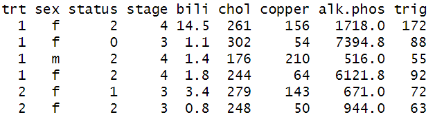
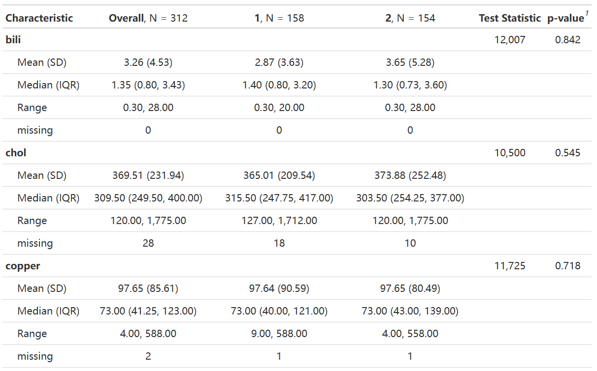

# gttable1:Make table1 in R

## :writing_hand: Author

Huiyao Chen

------------------------------------------------------------------------

## :arrow_double_down: Installation

Install the gttable1 package via the Github repository:

``` r
# install.package("remotes")   #In case you have not installed it.
remotes::install_github("chenhy-lab/gttable1")
```

------------------------------------------------------------------------
## Input



------------------------------------------------------------------------

## Output



------------------------------------------------------------------------

### Demo script

``` r
library(gttable1)
data(pbc, package = "survival")
cont_var <- c("bili","chol","copper","alk.phos","trig")
cat_var <- c("sex","status","stage")
group_var <- "trt"
tmp <- gttable1(data=pbc,group_var=group_var,cat_var=cat_var,cont_var=cont_var,out_format='gtobj',pDigits=3,method='auto')
tmp <- gttable1(data=pbc,group_var=group_var,cat_var=NULL,cont_var=cont_var,out_format='dataframe',pDigits=3,method='auto')
tmp <- gttable1(data=pbc,cont_var=cont_var,out_format='gtobj',pDigits=3,method='auto')
tmp <- gttable1(data=pbc,cat_var=cat_var,out_format='gtobj',pDigits=3,method='auto')
tmp <- gttable1(data=pbc,out_format='gtobj',pDigits=3,method='auto')

tmp <- gttable1(data=pbc,group_var=group_var,cat_var=cat_var,cont_var=cont_var,out_format='gtobj',pDigits=3,method='define')
tmp <- gttable1(data=pbc,group_var=group_var,cat_var=cat_var,cont_var=cont_var,out_format='dataframe',pDigits=3,method='define')
tmp <- gttable1(data=pbc,group_var=group_var,cont_var=cont_var,out_format='dataframe',pDigits=3,method='define')
tmp <- gttable1(data=pbc,cont_var=cont_var,out_format='gtobj',pDigits=3,method='define')
tmp <- gttable1(data=pbc,cat_var=cat_var,out_format='gtobj',pDigits=3,method='define')
tmp <- gttable1(data=pbc,out_format='dataframe',pDigits=3,method='define')
tmp <- gttable1(data=pbc,out_format='gtobj',pDigits=3,method='define')
```


## Related Tools

- [gtsummary](https://www.danieldsjoberg.com/gtsummary/): A package provides 
 an elegant and flexible way to create publication-ready analytical and summary tables using the R programming language.
